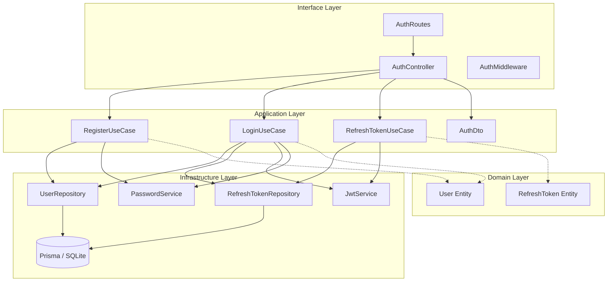

# Architecture: Auth Module

The Auth module follows **Clean Architecture** principles to ensure separation of concerns, testability, and independence from frameworks.

## 🏗️ Layer Breakdown

### 1. Domain Layer (`src/domain/`)
**Responsibility:** Enterprise business rules and entities.
- **Dependencies:** None.
- **Components:**
  - `User` Entity
  - `RefreshToken` Entity
  - `Role` Enum

### 2. Application Layer (`src/application/`)
**Responsibility:** Application-specific business rules (Use Cases). orchestrates data flow between Domain and Infrastructure.
- **Dependencies:** Domain, Infrastructure Interfaces (Repositories).
- **Components:**
  - `RegisterUseCase`: Handles user creation logic.
  - `LoginUseCase`: Validates credentials, generates **Family ID**, issues tokens.
  - `RefreshTokenUseCase`: implements **Rotation** and **Reuse Detection** logic.
  - `AuthDto`: Zod Schemas for input validation.

### 3. Infrastructure Layer (`src/infrastructure/`)
**Responsibility:** External agents (Database, Security libs).
- **Dependencies:** Application Interfaces, Domain.
- **Components:**
  - `PrismaClient`: Database connection.
  - `UserRepository`: Implementation of DB access for Users.
  - `RefreshTokenRepository`: Implementation of DB access for Tokens.
  - `JwtService`: Adapter for `jsonwebtoken`.
  - `PasswordService`: Adapter for `bcryptjs`.

### 4. Interface Layer (`src/interfaces/`)
**Responsibility:** Entry points (HTTP).
- **Dependencies:** Application Layer.
- **Components:**
  - `AuthController`: Handles HTTP Requests/Responses, Cookies.
  - `AuthRoutes`: Express Router definition.
  - `AuthMiddleware`: Protects routes using Access Token.

## 🔄 Dependency Graph

