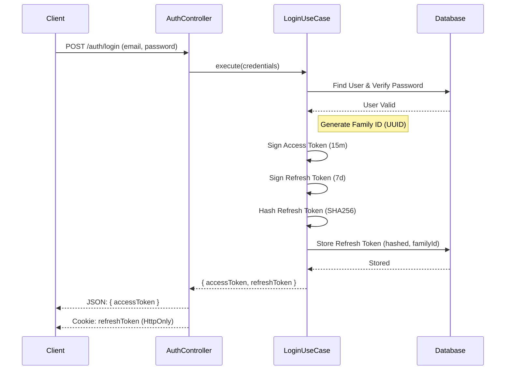
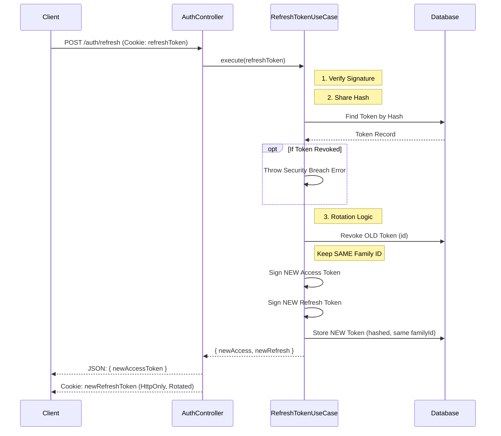
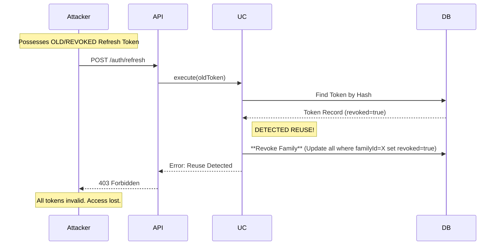

# Auth Workflows

This document details the critical flows within the Auth module, specifically focusing on the Security mechanisms.

## 🔐 Login Flow

When a user logs in, we establish a **Token Family** to track the lineage of refresh tokens.

## 🔄 Refresh Token Rotation (Success Case)

Used when Access Token expires. The client presents the valid Refresh Token cookie.

## 🚨 Reuse Detection (Security Breach)

What happens if an attacker steals an old refresh token and tries to use it?

